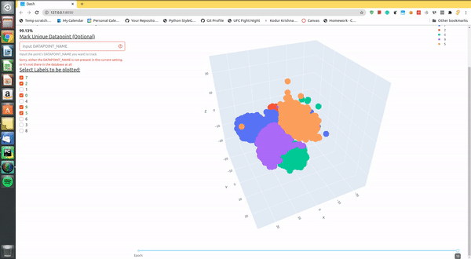
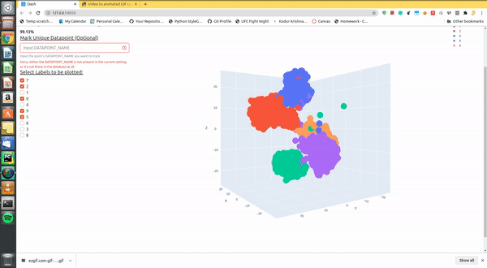
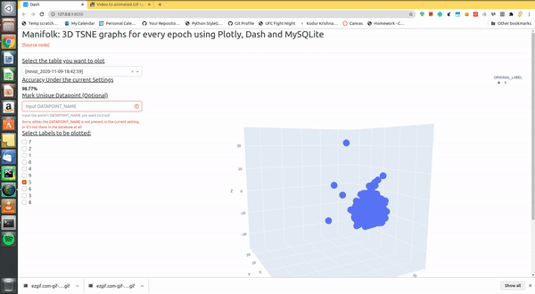

# Manifolk
Did you think that wouldn't it be nice to have a tool that would plot T-SNE graphs at each epoch, and only of specific labels you want to visualize? Which can help you visualize the T-SNE graph for specific labels de-cluttering the T-SNE cloud with many other labels? Find out which datapoints are near to the cluster and which aren't? Look no more!

Manifolk is a Plotly+Dash+MySQLite web application that does exactly that. During your model training process, you generate T-SNE embeddings using your favourite package (e.g. sklearn's T-SNE) and then use Manifolk's API to store all of them into an SQLite database. After the training is over the Dash app can be launched to visualize the 3D T-SNE embeddings. beware the T-SNE embeddings you generate must be 3D, not 2D (because why not have an extra dimension?).

## Installation Instructions
```bash

```
## Python API
## Screenshots
### Changing Epochs
The below screenshot shows how to change epochs and visualize the T-SNE at every epoch



### Changing Labels
The below screenshot shows how to change labels



### Marking a unique datapoint
The below image shows how to mark a unique datapoint which you want to track across epochs and different labels in the TSNE cloud



## Use Cases

## Note
This is still a work in progress. I will keep updating the repo and by November 30 the first beta version ready to be tested will be released. I am also in a lookout for more cool T-SNE visualization, so if you think you would like to add some more features, please feel free to create an issue and I will answer as soon as I can. Thanks for checking the repo out!